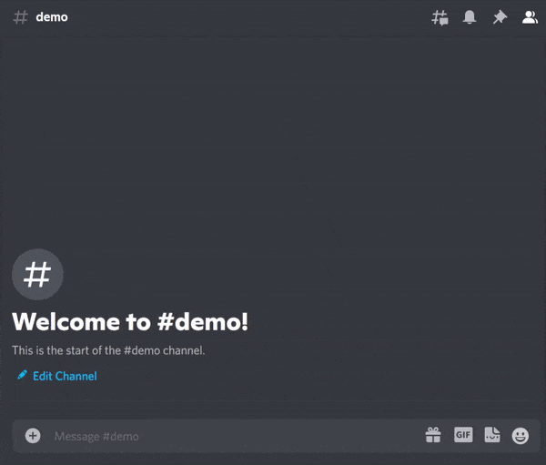

# Pleasantcord

> This bot has been deprecated. Do not try to visit the dashboard or invite the bot!

  

  
  
  
  
  
  

Pleasantcord is a simple NSFW image auto moderation bot 🤖 for Discord powered by [TensorFlow JS](https://www.npmjs.com/package/@tensorflow/tfjs-node). On the inside, it uses a pretrained model provided by [nsfw.js](https://github.com/infinitered/nsfwjs) that is able to distinguish image category to several categories.

  

> This is just a demo. Of course Pleasantcord won't remove Cuphead images!

## Installation

Invite this bot to your server by clicking [this link](https://discord.com/api/oauth2/authorize?client_id=750668307555942482&permissions=2147493888&scope=bot%20applications.commands).

The bot itself requires the following permission in your server, make sure that the bot has **all** the permissions below:

- `Send Messages`
- `Manage Messages`
- `Use Slash Commands`

Besides the above permissions, make sure that `pleasantcord` is able to view and access your channels.

Failed to comply with those requirements may result `pleasantcord` to throw `Missing permissions` or `Missing Access`.

## Commands

All commands are prefixed with `pc!`

Command | Description
------- | -----------
`status` | Show the bot status (ping, environment, etc).
`config` | View server config
`help` | Show the bot help menu.

## FAQ

### What's the default behavior of `pleasantcord`?

By default, `pleasantcord` will classify any image contents as NSFW when it has `Hentai` or `Porn` label with more than 70% accuracy and delete it from any **text channel** that isn't configured to be a NSFW channel.

### Animated `webp` and `png` throw errors!

Discord cannot display them correctly, yet there's no way to distinguish them from normal non-animated one as they share the same header.

### The classification is incorrect!

I'm not the one who created the model, so I can't say anything about it. That being said, image classification is an ML algorithm which could produce false alarms from time to time, so false alarms are quite common occurence.

## Data Privacy

Technically, `pleasantcord` won't store any of your data. However when `pleasantcord` has encountered an error on your server, `pleasantcord` will store the stacktrace on the logging system which *may* include your personal data (which is 100% embeddable content). This is done to ensure easier error debugging and fixing.

When the issue has been detected, acknowledged, and analyzed, your personal data will **immediately** deleted. If you feel that your data is still stored on our system, ~~feel free to join our support server and contact the moderators directly.~~

## Dashboard

You can access the full open-source code of the dashboard [here](https://github.com/Namchee/pleasantcord-dashboard)

## Credits

- [infinitered](https://github.com/infinitered) — Provides an easy-to-use pretrained model for NSFW detection.
- [Namchee](https://github.com/Namchee/pleasantcord) — (me) For working on the project!

## License

This project is licensed under the [MIT License](LICENSE)
