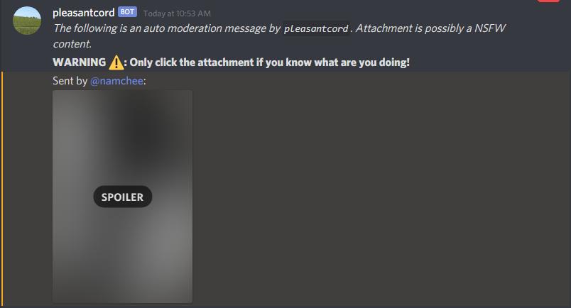

# Pleasantcord

Pleasantcord is a simple NSFW image moderation bot 🤖 for Discord.

It uses [Clarifai](https://www.clarifai.com/) to classify any message attachments sent on a server. Once the attachment is classified as a possible NSFW content, this bot will delete the original message and repost it with a warning and spoiler tag.

The bot behavior's can be controlled from the config file.

## Requirements

1. Working Docker installation
2. [Clarifai](https://www.clarifai.com/) Account (possibly changed)
3. Discord Developer Account

## Installation

> You **MUST** self-host this bot yourself.

1. Clone the repository
2. Navigate to your freshly cloned git directory
3. Create a new `.env` file in the current directory
4. Fill the new `.env` file with the instructions on `.env.sample` file
5. Execute `docker-compose up` from your favorite terminal.

## Deployment

TBD

## Configuration

Below is the list of possible configuration for the bot

Key | Description
--- | -----------
`name` | Discord's bot name
`imageUrl` | Image to be shown on rich message embeds. Should be same as the bot display picture from Discord's Developer Portal.
`commandPrefix` | Prefix for various commands for the bot.
`confidence` | Threshold for NSFW content prediction. Any content will be moderated if the NSFW probability is higher than this value.
`deleteNSFW` | Determine if the bot should repost the NSFW content.
`warn.count` | Determine how many times should a member be warned when commiting a NSFW violation before being banned / kicked
`warn.refreshPeriod` | Determine expiration time for member's violation in seconds.
`ban` | Determine if excess violators should be banned instead of kicked.

> This bot **DOES NOT** provide an `unban` command.

## Commands

Command | Description
------- | -----------
`warnings` | Count how many NSFW violation you've made.

## Motivation

Discord has [NSFW Channel System](https://support.discord.com/hc/en-us/articles/115000084051-NSFW-Channels-and-Content). Unfortunately, it can't prevent NSFW content to be posted
on SFW channels and still requires manual moderation. This bot aims to fix that.

## Acknowledgements

- Profile image is taken from [this Unsplash image](https://unsplash.com/photos/6F2k0tqNuG4) by [Hongru Wang](https://unsplash.com/@hongru_wang)

## License

This project is licensed under [MIT License](LICENSE)
